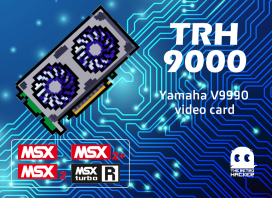
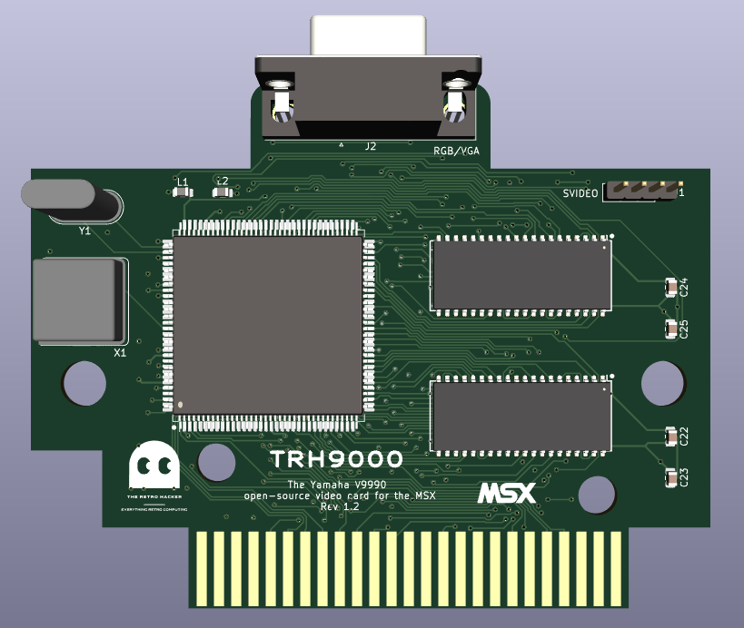
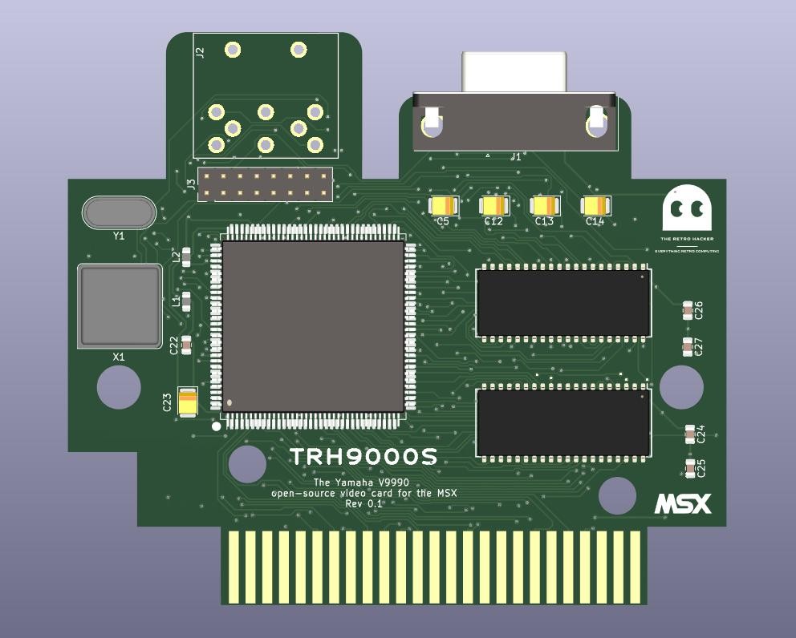
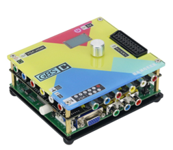
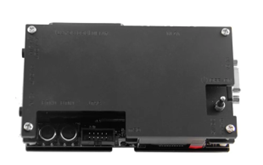
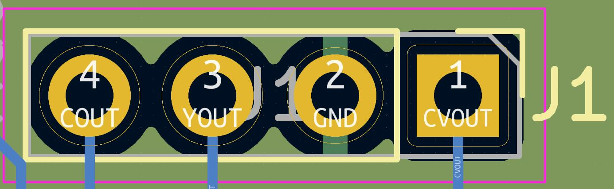
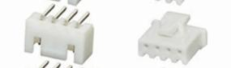
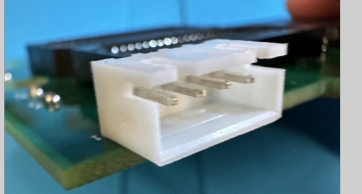
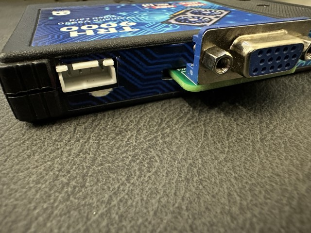
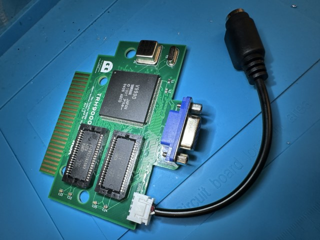

# TRH9000 and TRH9000S
Yamaha V9990 based open-source video cards for the MSX

## Introduction

If you ever spent just a few minutes on YouTube searching for MSX content, I bet you certainly found some footage covering the V9990. Well, not specifically the V9990 chip, but video cards based on it.

The first video card based on the unreleased, kind of obscure Yamaha V9990 VDP chip was the Graphics9000 (or GFX9000). The GFX9000 is (was) an MSX standard graphics expansion device for home computers developed by Sunrise in 1994.

It was designed as an expansion cartridge for the MSX standard that can be installed in a slot on a computer that also connects to the computer’s video output and monitor. The device works as an additional independent video controller.

The device is based on the Yamaha V9990 video controller (VDP). The chip was based on the never-produced V9978 chip, designed specifically for use in computers of the alleged but not implemented (by the time of this writing) MSX3 standard. Compared to the V9978, the V9990 is not backward compatible with the V99x8 chips, and thus cannot be used as the main video controller of standard MSX-compatible computers.

## The TRH9000 and the TRH9000S

TRH9000 is a recently developed open-source implementation of the GFX9000, representing a community-driven effort to document everything necessary to build MSX cartridges that can run V9990 software.

TRH9000S has the same features of the simpler TRH9000 plus the capability to superimpose the image from the MSX computer where it is connected to the image generated by the V9990 VDP (using a cable connected to an input RGB connector on the cartridge).

The goal is to make the card more accessible and improve the amount of software available for it. 

## Technical Information

The TRH9000 is a graphics expansion cartridge designed for MSX computers that was developed by a community of MSX enthusiasts as an open-source implementation of the GFX9000. 

### Selection Logic
For the TRH9000, the control logic is implemented by two ICs. According to the not exhaustive list of IO ports documented [here](https://www.msx.org/wiki/I/O_Ports_List). The IO ports used the by an GFX9000 compatible cartridge must be 60h~6Fh*. The 74HCT138 IC on the board performs the selection of those IO ports and with the aid of the 74HC32 performs the activation of the appropriate signals on the V9990 chip.

### RAM chips

The KM428C256 RAM chip is the primary memory module used in the TRH9000 for MSX. It is a CMOS 256K x 8 bit dual-port dynamic random-access memory (DRAM) chip that serves as the primary memory module in the TRH9000 for MSX. We use two memory chips on the cartridge, wired to the Yamaha V9990 VDP.

### Connectors

The TRH9000 features two types of video output connectors: a DB15 RGB/VGA connector and a pin header that carries the SVIDEO signal. The DB15 connector is a standard video connector that supports VGA, and RGB, making it a versatile choice for connecting to various types of displays. The SVIDEO signal, on the other hand, is a video signal that carries the chrominance and luminance components of the video separately, resulting in a higher quality image than composite video. 

The SVIDEO signal is carried via the pin header, which is also included in the TRH9000 cartridge. This provides users with the flexibility to choose the type of video output connector that best suits their display device. 

Additionally, the TRH9000S version of the cartridge features two connectors, including a DIN8 270 connector that allows for input from the MSX computer and the DB15 RGB/VGA connector for video output. 

### Video Output

#### RGB 
The TRH9000 cartridge produces RGB signal with a horizontal frequency of 15KHz, which was the standard at the time of the V9990 chip's release. If you plan to connect the cartridge directly to your monitor using a VGA cable, it's important to ensure that your monitor supports synchronization at 15KHz.

You can see a list of modern monitors with support to 15KHz available at http://15khz.wikidot.com/

If you're not getting any image from the cartridge connector, it indicates that your monitor cannot sync at 15KHz. Typically, modern monitors can only sync at frequencies above 31KHz.

In such a scenario, you will require an adapter to upscale the frequency, making it compatible with your monitor. These adapters are commonly used for vintage video games and are readily available in various marketplaces. Here are a few options to consider:

||Description|Link|
|--|--|--|
||TZT HamGeek GBSC Converter GBS Control Retro Video Game Signal Converter Gaming Accessory  |[Ali Express](https://s.click.aliexpress.com/e/_DcZRM6T)
||OSSC HDMI-Compatible Converter Open Source Scan Adapter Kit with Game Cable for Retro Game Consoles  |[Ali Express](https://s.click.aliexpress.com/e/_DnNQGvv)
||Retrotink 2X Scart | https://www.retrotink.com/product-page/retrotink-2x-scart

If you decide to use the Retrotink you will need a VGA to SCART cable. That is easy to solder and you need to connect the signals in the following way:

|VGA||SCART|Signal|
|-|-|-|-|
|1|-->|15 |Red
|2|-->|11| Green
|3|--> |7 |Blue
|5|--> |21 |GND
|13|-->|20| Sync

By request of the community a jumper was included on the latest PCB version to provide optionally 5V on the pin 9 of the VGA connector. This is useful for those who want to use build a SCART cable that depending on the monitor may require 5V in some pins. 

The jumper is located on the back of the PCB and is labeled as "JP1". The default position is open, so if you need to use it, you will need to close it with a solder blob.

Here is a diagram of the DH15 connector:

#### S-Video and Composite

The TRH9000 cartridge provides support for both S-Video and Composite video outputs. These video signals are transmitted through a pin header situated on the upper right side of the cartridge PCB.

Please note that only the S-Video signal is accessible on the pin header in v1.3. The Composite signal becomes available starting from the v1.4 version.

To utilize these signals, you'll need to construct a cable that links the pin header to the S-Video or Composite input of your monitor.

The pinout of the pin header is as follows:

As a reference the following image presents the pinout for S-Video and Composite connectors:

Please use the tables shown below to build your cables.

* S-SVIDEO uses COUT, YOUT and GND

|Pin Svideo|TRH9000 Pin Header|Signal|
|-|-|-|
|1 - GND|2 - GND|Ground|
|2 - GND|2 - GND|Ground|
|3 - Y|3 - YOUT|Luminance|
|4 - C|1 - COUT|Chrominance|

* Composite uses CVOUT and GND

|Pin Composite|TRH9000 Pin Header|Signal|
|-|-|-|
|SIGNAL|1 - CVOUT |Composite Signal|
|GROUND|2 - GND|Ground|

For optimal cable construction and secure locking during use, I recommend using an XHB2.54 angled connector with a buckle. This item is available for purchase on Ali Express [here](https://s.click.aliexpress.com/e/_DDveDbh).

Below you can find some pictures of the TRH9000 cartridge connector and the SVIDEO cable. These images can help you better understand how to connect your cartridge to your monitor and ensure that you have a stable video output.

| XHB2.54 Connector Soldered | XHB2.54 Case Hole | S-Video Cable Connected to TRH9000 |
| --- | --- | --- |
|  |  |  |

## Bill of Materials

[TRH9000 Interactive BOM](https://htmlpreview.github.io/?https://github.com/cristianoag/trh9000/blob/main/Hardware/Kicad/TRH9000.cxa2075/bom/ibom.html)

|References|Value|Footprint|Qtd|Link|
|-|-|-|-|-|
|C1, C6, C7, C8, C17, C19, C20, C22, C24	|0.1uF	|C_0805_2012Metric	|9|[Ali Express](https://s.click.aliexpress.com/e/_DkAAT2J)
|C9, C11, C12, C13, C14, C15, C26|	220uF	|CP_EIA-3528-15_AVX-H|	7|[Ali Express](https://s.click.aliexpress.com/e/_DCrPttV)
|C3, C4	|27pF|	C_0805_2012Metric|	2|[Ali Express](https://s.click.aliexpress.com/e/_DkAAT2J)
|C5, C10|	47pF	|C_0805_2012Metric|	2|[Ali Express](https://s.click.aliexpress.com/e/_DkAAT2J)
|C16, C18|	1uF	|C_0805_2012Metric	|2|[Ali Express](https://s.click.aliexpress.com/e/_DkAAT2J)
|C23, C25|	10nF|	C_0805_2012Metric|	2|[Ali Express](https://s.click.aliexpress.com/e/_DkAAT2J)
|C2|	10uF|	C_0805_2012Metric	|1|[Ali Express](https://s.click.aliexpress.com/e/_DkAAT2J)
|C21|	47uF|	CP_EIA-3528-15_AVX-H|	1|[Ali Express](https://s.click.aliexpress.com/e/_DCrPttV)
|R1, R3, R4, R5, R6, R10|	4K7	|R_0805_2012Metric|	6|[Ali Express](https://s.click.aliexpress.com/e/_DEyTmBN)
|R14, R15, R16, R17, R18, R19|	75R	|R_0805_2012Metric|	6|[Ali Express](https://s.click.aliexpress.com/e/_DEyTmBN)
|R7, R12|	2K2	|R_0805_2012Metric|	2|[Ali Express](https://s.click.aliexpress.com/e/_DEyTmBN)
|			R2	|10M	|R_0805_2012Metric|	1|[Ali Express](https://s.click.aliexpress.com/e/_DEyTmBN)
|			R8	|1K	|R_0805_2012Metric|	1|[Ali Express](https://s.click.aliexpress.com/e/_DEyTmBN)
|			R9	|100R	|R_0805_2012Metric|	1|[Ali Express](https://s.click.aliexpress.com/e/_DEyTmBN)
|			R11	|220R	|R_0805_2012Metric	|1|[Ali Express](https://s.click.aliexpress.com/e/_DEyTmBN)
|			R13	|3K3|	R_0805_2012Metric	|1|[Ali Express](https://s.click.aliexpress.com/e/_DEyTmBN)
|			L1, L2|	4.7uH|	L_0805_2012Metric	|2|[Ali Express](https://s.click.aliexpress.com/e/_Dern3vN)
|			U4, U5	|KM428C256	|SOJ-40_400mil|	2|[UT Source](https://www.utsource.net/itm/p/781989.html)
|			U1	|74HC138	|SO-16_3.9x9.9mm_P1.27mm	|1|[Ali Express](https://s.click.aliexpress.com/e/_De0MrAf)
|			U2	|74HC32	|SO-14_3.9x8.65mm_P1.27mm|	1|[Ali Express](https://s.click.aliexpress.com/e/_DlCjJDN)
|			U3|	V9990|	LQFP-128_28x28mm_P0.8mm	|1|[The Retro Hacker Store](https://theretrohacker.com/product/v9990-non-vga-video-controller-ic-qfp-128/)
|			U6	|CXA2075M	|SOP-24_7.5x15.4mm_P1.27mm|	1|[Ali Express](https://s.click.aliexpress.com/e/_DBjZMTN)
|			Y1	|21.47727Mhz	|Crystal_HC49-U_Vertical|	1|[Ali Express](https://s.click.aliexpress.com/e/_DDj3q9t)
|			X1	|14.31818MHz|	Oscillator_DIP-4|	1|[Ali Express](https://s.click.aliexpress.com/e/_DEBzKw3)
|			RV1, RV2, RV3	|500R	|Potentiometer_Bourns_3314G_Vertical	|3|[Ali Express](https://s.click.aliexpress.com/e/_DnebEdD)
|			Q1	|BC817	|SOT-23	|1|[Ali Express](https://s.click.aliexpress.com/e/_DBlTES3)
|			J1	|S-Video	|PinHeader_1x04_P2.54mm_Vertical	|1|[Ali Express](https://www.aliexpress.com/item/4000660389713.html?spm=a2g0o.productlist.main.57.317d7e3eUGQTIV&algo_pvid=a46f4c47-7f70-444c-9afd-da63e8168c8d&algo_exp_id=a46f4c47-7f70-444c-9afd-da63e8168c8d-28&pdp_npi=4%40dis%21USD%210.58%210.58%21%21%210.58%21%21%40210318d116955940405873957e8c39%2110000005517155325%21sea%21BR%21178731568%21&curPageLogUid=7yUOMNZ7S7A6)
|			J2	|RGB	|DSUB-15-HD_Female_Horizontal	|1|[Ali Express](https://s.click.aliexpress.com/e/_DntckRl)

## Kudos

There are a few folks activelly helping with the project and I would like to call them out here:

* Alexandre Souza
* Doomn00b
* Darlei Duarte
* lintweaker
* Luciano Sturaro
* MetalGear2
* sdsnatcher73
* sdsnatcher
* Thiago Valença
* Wagner Tavares

## License 

This work is licensed under the CERN OHL-S v2. You may redistribute and modify this project and its documentation under the terms of the CERN-OHL-S v2.

