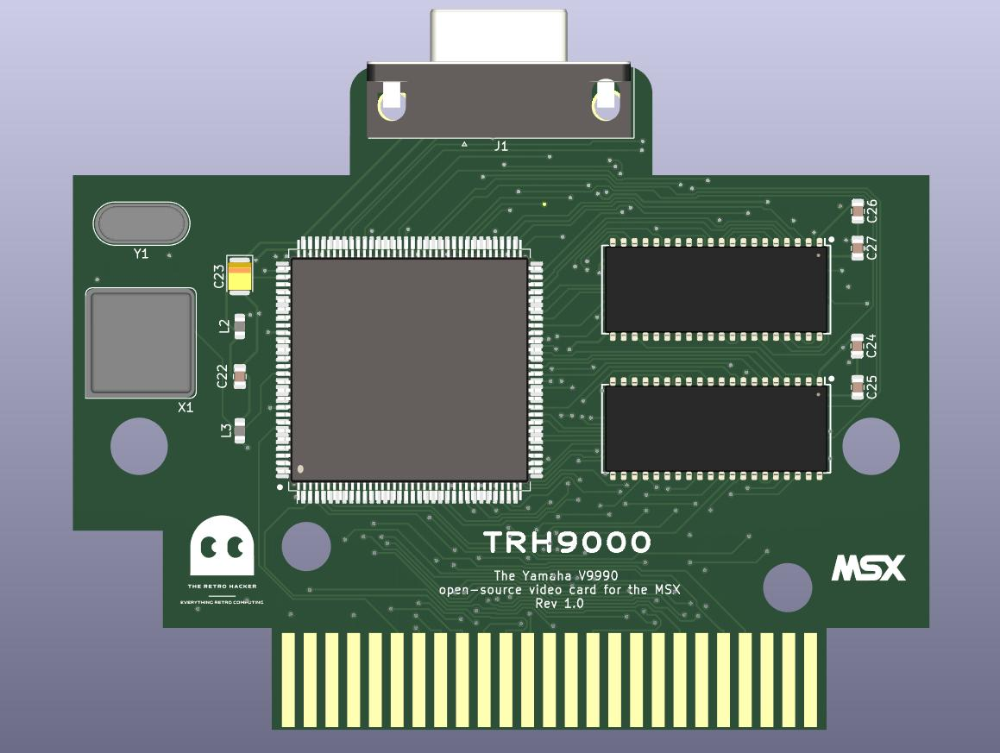

# TRH9000 and TRH9000S
Yamaha V9990 based open-source video cards for the MSX

## Introduction

If you ever spent just a few minutes on YouTube searching for MSX content, I bet you certainly found some footage covering the V9990. Well, not specifically the V9990 chip, but video cards based on it.

The first video card based on the unreleased, kind of obscure Yamaha V9990 VDP chip was the Graphics9000 (or GFX9000). The GFX9000 is (was) an MSX standard graphics expansion device for home computers developed by Sunrise in 1994.

It was designed as an expansion cartridge for the MSX standard that can be installed in a slot on a computer that also connects to the computer’s video output and monitor. The device works as an additional independent video controller.

The device is based on the Yamaha V9990 video controller (VDP). The chip was based on the never-produced V9978 chip, designed specifically for use in computers of the alleged but not implemented (by the time of this writing) MSX3 standard. Compared to the V9978, the V9990 is not backward compatible with the V99x8 chips, and thus cannot be used as the main video controller of standard MSX-compatible computers.

## The TRH9000 and the TRH9000S

TRH9000 is the name of a brand new open-source implementation of the GFX9000. It is a community effort to create everything required to build MSX cartridges capable to run V9990 software.

TRH9000S has the same features of the simpler TRH9000 plus the capability to superimpose the image from the MSX computer where it is connected to the image generated by the V9990 VDP (using a cable connected to an input RGB connector on the cartridge).

The goal is to make the card more accessible and improve the amount of software available for it. 

## Kudos

There are a few folks activelly helping with the project and I would like to call them out here:

* Alexandre Souza
* Doomn00b
* Darlei Duarte
* lintweaker
* Luciano Sturaro
* sdsnatcher73
* sdsnatcher
* Thiago Valença

## Technical Information

According to the not exhaustive list of IO ports documented [here](https://www.msx.org/wiki/I/O_Ports_List). The IO ports used the by an GFX9000 compatible cartridge must be 60h~6Fh*. The 74HCT138 IC on the board performs the selection of those IO ports and with the aid of the 74HC32 performs the activation of the appropriate signals on the V9990 chip.

...To be updated!...

 
## License 

This work is licensed under the CERN OHL-S v2. You may redistribute and modify this project and its documentation under the terms of the CERN-OHL-S v2.

